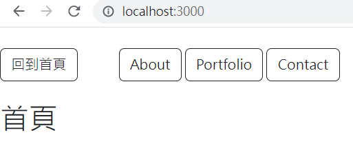

# Express 驗收



## 介紹
Alpha Camp 的學期 2-3 的練習題目，練習 Express 路由設定。

## 功能
點擊不同的 button，會顯示不同的字句，讓使用者知道畫面有變動。

## 安裝步驟
1. 請先確認有安裝 node.js 與 npm ，版本號請參考下方的**開發工具**說明。

2. 將專案 clone 到本地。

3. 在本地開啟之後，透過終端機進入資料夾，輸入：<br>
    ```npm install```

4. 安裝完畢後，繼續輸入：<br>
    ```npm run start``` <br>
    若看見此行訊息則代表順利運行，打開瀏覽器進入到以下網址<br>
    ```Listening on http://localhost:3000```

5. 若欲暫停使用請按下 ```ctrl + c```

## 開發工具
* Node.js 18.12.1
* Express 4.16.4
* Express-Handlebars 3.0.0
* Bootstrap 5.1.3